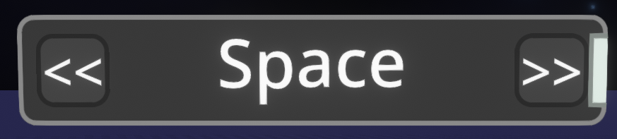

Logix Visual Customizer
=======================

Fro Zen's personal fork of Logix Visual Customizer

- Removes local user overridden settings, node changes are visible to everyone
    - The original system also seems to be broken, and doesn't override values properly in sessions with multiple users who have the mod, so this shouldn't break here
- Asset system rewrite
- Adds styling to Enum inputs

